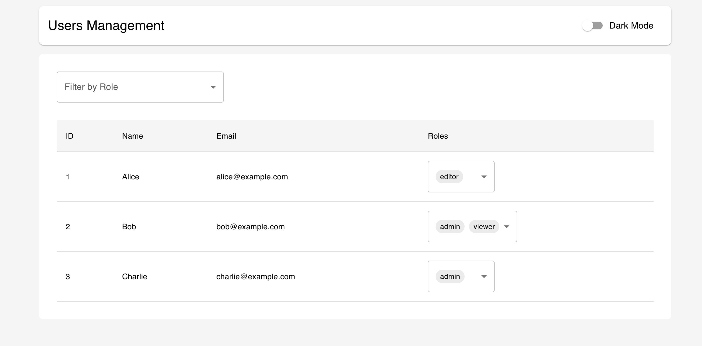
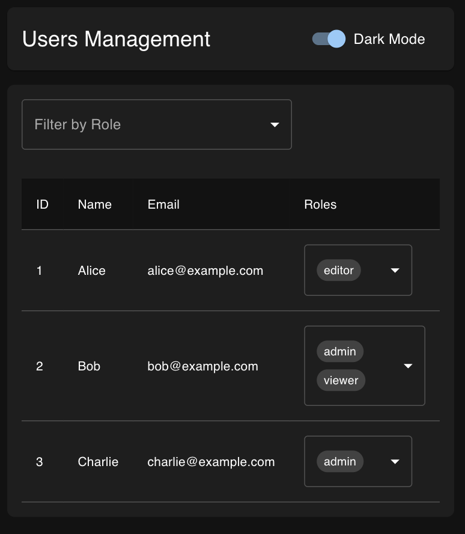

# My Roles - Users Management Application

A full-stack application for managing users and their roles.  
It consists of two main parts:

- Web client: React + Next.js frontend for managing users, editing roles, and filtering by roles.
[Web README](./web/README.md)
- Server: Node.js + Express backend providing REST API endpoints for users and role management.
[Server README](./server/README.md)

---

## Screenshot




---

## Setup Instructions

### 1. Backend (Server)

1. Navigate to the `server` folder:
   ```bash
   cd server

2. Install dependencies:
    npm install

3. Create environment variables file .env:
    PORT=8000
    # Add any other required variables here

4. Start the server:
    npm run dev

    The API will be available at http://localhost:8000

5. Run server tests:
    npm run test

### 2. Frontend (Web)

1. Navigate to the web folder:
    cd web

2. Install dependencies:
    npm install

3. Create environment variables file .env.local:
    NEXT_PUBLIC_API_URL=http://localhost:8000

4. Start the development server:
    npm run dev

    The web app will be available at http://localhost:3000

5. Run frontend tests:
    npm run test

---

## Features
- Full CRUD support for users via backend API
- Frontend table to display users with filtering by roles
- Multi-select for editing user roles
- Dark mode toggle
- Snackbar notifications for updates and errors

---

## Assumptions / Tradeoffs
- Roles are fixed: 'admin', 'editor', 'viewer'.
- No authentication implemented in this demo version.
- Frontend uses mocked behavior for tests; backend validation required for production.
- UI library: Material-UI (MUI v7)
- Server assumes standard REST API endpoints /users and /users/:id/roles.

---

## Tech Stack

- Frontend: React 18, Next.js 13, TypeScript, Material-UI
- Backend: Node.js, Express, TypeScript
- Testing: Jest, React Testing Library, Supertest, jest-fetch-mock